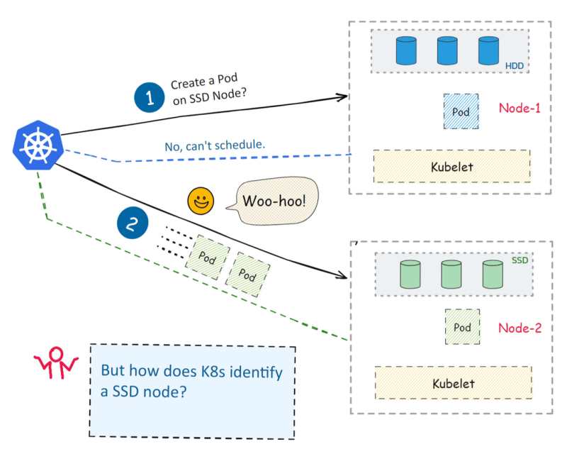

# Kubernetes

## Index
* [Detailed explanation of Kubernetes Architecture](https://devopscube.com/kubernetes-architecture-explained/)
* [Pods](#pods)
* [Replica Controller](#replica-controller)
* [Replica Set](#replica-set)
* [Deployment](#deployment)
  1. Rolling Update:
     * [Updating Deployment](#updating-a-deployment)
     * [Checking rollout history of deployment](#checking-rollout-history-of-a-deployment)
     * [Rolling back to previous version](#checking-rollout-history-of-a-deployment)

  2. Blue/Green Update:
* [Types of Deployment](#deployments-in-kubernetes)
  * [Recreate](#recreate)
  * [Ramped](#ramped)
  * [Blue/green](#bluegreen)
  * [Canary](#canary)
  * [A/B testing](#ab-testing)
  * [Shadow](#shadow)
* [Ingress](https://github.com/maveric-coder/Kubernetes/tree/main/kubernetes_ingress)
* [Managing EKS](#managing-eks)
* [Node Labels](#node-labels)
* [Node Affinity](#node-affinity-node-selector)
* [Drain Nodes](#drain-nodes)
* [Pod Lifecycle](#pod-lifecycle)
* [Bare Metal Cluster](#bare-metal-cluster)
## Pods
 <br>
A pod is a group of one or more containers. A container is an enclosed, self-contained execution process, much like a process in an operating system. Kubernetes uses pods to run your code and images in the cluster.

Kubernetes works with Pods, rather than containers, so that containers in the same pod can be guaranteed to run on the same machine. Containers in the same pod share their networking infrastructure, storage resources, and lifecycle.

let us create a simple pod by cloning the below repository:
```bash
git clone https://github.com/maveric-coder/Kubernetes.git
cd Kubernetes/files/Kubernetes-Manifest-Files/
cat nginxpod.yml
```
```yaml
apiVersion: v1
kind: Pod
metadata:
  name: nginx-pod
  lables:
    app: nginx
spec:
  containers:
    -name: nginx-container
      image: nginx
      ports:
      - containerPort: 80
```
Post deployment we can see the newly created Pod using command `kubectl get pods -o wide` or `kubectl get all -o wide`.
The above yml file will deploy a single pod.

## Replica Controller
A Replication Controller is a structure that enables us to easily create multiple pods, then it makes sure that that number of desired pods always exists(desired state = actual state). If a pod does crash, the Replication Controller replaces it.

A Kubernetes controller such as the Replication Controller also provides other benefits, such as the ability to scale the number of pods, and to update or delete multiple pods with a single command.

We can create a Replication Controller with an imperative command, or declaratively, from a file.  For example, let us see the file `rc.yml` file:

```yml
apiVersion: v1
kind: ReplicationController
metadata: 
  name: nginx-rc
spec:
  replicas: 4
  selector:
    app: nginx
  template:
    metadata:
      name: nginx
      labels:
        app: nginx
    spec:
      containers:
        - name: nginx
          image: nginx
          ports:
            -containerPort: 80
```
This will create 4 pods and in case any pod will crash for any reason, it will immediately create a new pod and remove the defected pod.
To scale the no of pods post deployment, we can either modify the `rc.yml` file or use the below command. 
```bash
kubectl scale rc nginx-rc --replicas = 5
```
## Replica Set

ReplicaSets are declared in essentially the same way as ReplicationControllers, except that they have more options for the selector.

A sample Replica Set is below:
```yml
apiVersion: v1
kind: ReplicaSet
metadata:
  name: nginx-replicaset
spec:
  replicas: 3
  selector:
    matchLabels:
      app: nginx
    matchExpressions:
      - key: env
        operator: In
        values:
          - dev
  template:
    metadata:
      name: nginx
      labels:
        app: nginx
        env: dev
    spec:
      containers:
      - name: nginx-container
        image: nginx
        ports:
        - containerPort: 80
```
This will deploy pods similar to that of replication controller the only difference between them is that ***RS*** has `matchLabels` in place of `labels`.
```bash
kubectl describe rs nginx-replicaset
```
In this case `Selector: app=nginx,env in (dev)`, only `app = nginx` and env in dev is getting selected. If we change the operator from `In` to `NotIn` the deployemnt will fail as there is mismatch of the labels.

## DaemonSet
A DaemonSet ensures that all (or some) Nodes run a copy of a Pod. As nodes are added to the cluster, Pods are added to them. As nodes are removed from the cluster, those Pods are garbage collected. Deleting a DaemonSet will clean up the Pods it created.

Some typical uses of a DaemonSet are:

* running a cluster storage daemon on every node
* running a logs collection daemon on every node
* running a node monitoring daemon on every node

```yml
# Daemon Set
apiVersion: apps/v1
kind: DaemonSet
metadata:
  name: nginx-ds
spec:
  selector:
    matchLabels:
      app: nginx
  template:
    metadata:
      name: nginx-pod
      labels:
        app: nginx
    spec: 
      containers:
        - name: nginxcontainer
          image: nginx
          ports:
          - containerPort: 80
```

If you specify a `.spec.template.spec.nodeSelector`, then the DaemonSet controller will create Pods on nodes which match that node selector. Likewise if you specify a `.spec.template.spec.affinity`, then DaemonSet controller will create Pods on nodes which match that node affinity. If you do not specify either, then the DaemonSet controller will create Pods on all nodes.


## Deployment
A Deployment provides declarative updates for Pods and ReplicaSets.

### 1. Rolling Update:
   
We describe a desired state in a Deployment, and the Deployment Controller changes the actual state to the desired state at a controlled rate. We can define Deployments to create new ReplicaSets, or to remove existing Deployments and adopt all their resources with new Deployments.
```yaml
apiVersion: apps/v1
kind: Deployment
metadata:
  name: nginx-deployment
  labels:
    app: nginx
spec:
  replicas: 3
  selector:
    matchLabels:
      app: nginx
  template:
    metadata:
      labels:
        app: nginx
    spec:
      containers:
      - name: nginx
        image: nginx:1.14.2
        ports:
        - containerPort: 80
```
```bash
kubectl describe deployment nginx-deployment
```

The `StrategyType` is `RollingUpdate`. This value can also be set to `Recreate`.
By default we have a `minReadySeconds` value of `0`; we can change that value if we want pods to be up and running for a certain amount of time -- say, to load resources -- before they're truly considered "ready".
The `RollingUpdateStrategy` shows that we have a limit of `1` `maxUnavailable` -- meaning that when we're updating the Deployment, we can have up to `1` missing pod before it's replaced, and `1 maxSurge`, meaning we can have one extra pod as we scale the new pods back up.

The created ReplicaSet ensures that there are three nginx Pods.

The pod-template-hash label is added by the Deployment controller to every ReplicaSet that a Deployment creates or adopts.

This label ensures that child ReplicaSets of a Deployment do not overlap. It is generated by hashing the PodTemplate of the ReplicaSet and using the resulting hash as the label value that is added to the ReplicaSet selector, Pod template labels, and in any existing Pods that the ReplicaSet might have.

### Updating a Deployment
**Note:** A Deployment's rollout is triggered if and only if the Deployment's Pod template (that is, .spec.template) is changed, for example if the labels or container images of the template are updated. Other updates, such as scaling the Deployment, do not trigger a rollout.

Follow the steps given below to update your Deployment:

**1. Let's update the nginx Pods to use the nginx:1.16.1 image instead of the nginx:1.14.2 image.**

```bash
kubectl set image deployment.v1.apps/nginx-deployment nginx=nginx:1.16.1
```
or use the following command:

```bash
kubectl set image deployment/nginx-deployment nginx=nginx:1.16.1
```
where deployment/nginx-deployment indicates the Deployment, nginx indicates the Container the update will take place and nginx:1.16.1 indicates the new image and its tag.

The output is similar to: `deployment.apps/nginx-deployment image updated`

**2. To see the rollout status, run:**
```bash
kubectl rollout status deployment/nginx-deployment
```
  * Run `kubectl get rs` to see that the Deployment updated the Pods by creating a new ReplicaSet and scaling it up to 3 replicas, as well as scaling down the old ReplicaSet to 0 replicas.
```bash
kubectl get rs
```
  * Running `get pods` should now show only the new Pods:
```bash
kubectl get pods
```

### Checking Rollout History of a Deployment
Follow the steps given below to check the rollout history:

**1. First, check the revisions of this Deployment:**
```bash
kubectl rollout history deployment/nginx-deployment
```

**2. To see the details of each revision, run:**
```bash
kubectl rollout history deployment/nginx-deployment --revision=2
```
### Rolling Back to a Previous Revision
Follow the steps given below to rollback the Deployment from the current version to the previous version, which is version 2.

**1. Now you've decided to undo the current rollout and rollback to the previous revision:**
```bash
kubectl rollout undo deployment/nginx-deployment
```
Alternatively, you can rollback to a specific revision by specifying it with --to-revision:
```bash
kubectl rollout undo deployment/nginx-deployment --to-revision=2
```

**2. Check if the rollback was successful and the Deployment is running as expected, run:**
```bash
kubectl get deployment nginx-deployment
```
**3. Get the description of the Deployment:**
```bash
kubectl describe deployment nginx-deployment
```

### 2. Blue/Green Update:

Blue Green is a deployment pattern that reduces downtime by running two identical production environments called blue and green. Only one environment lives at a time.

We need to ensure about the changes. Changes must be forward and backward-compatible. We need to set up a parallel infrastructure i.e. same number of servers and services used in the actual infrastructure. Post the setup deploy the new version to the new infrastructure, do the sanity, and validate everything. Then switch all the traffic to the green infrastructure. After everything is validated, remove or stop the old infrastructure (blue).

### Create a namespace and Deployment

Run below command to create the namespace

```zsh
kubectl create namespace blue-green-deployment
```
Now, Create Deployment
```yml
apiVersion: apps/v1
kind: Deployment
metadata:
  name: nginxv1
  labels:
    app: nginx
    env: blue
spec:
  replicas: 3
  selector:
    matchLabels:
      app: nginx
      env: blue
  template:
    metadata:
      labels:
        app: nginx
        env: blue
    spec:
      containers:
      - name: nginx
        image: nginx:1.14
        ports:
        - containerPort: 80
```
Save this manifest as blue-deployment.yaml, and create the deployment in the blue environment using the below command:
```zsh
kubectl apply -f blue-deployment.yaml -n blue-green-deployment
```

**Create a Service**
Now, we need to create a service that will expose our application to the outside world. The service should use the label selector to route traffic to either the blue or green deployment. Create a manifest file and add the below code to it.
```yml
apiVersion: v1
kind: Service
metadata:
  name: web-service
spec:
  selector:
    app: nginx
    env: blue
  ports:
  - name: http
    port: 80
    targetPort: 80
  type: LoadBalancer
```
Save this manifest as `service.yaml`, and create the service using the below command:
```zsh
kubectl apply -f service.yaml -n blue-green-deployment
```
Now, let’s verify that the deployments and service are working correctly. To do this, we need to get the external IP address of the service:
```sh
kubectl get service -n blue-green-deployment
```
For minikube, in a new shell execute the below command to get the IP and port no. from `get service` shell.
```sh
minikube tunnel
```

Now, Create Green Deployment
```yml
apiVersion: apps/v1
kind: Deployment
metadata:
  name: httpd1
  labels:
    app: httpd
    env: green
spec:
  replicas: 3
  selector:
    matchLabels:
      app: httpd
      env: green
  template:
    metadata:
      labels:
        app: httpd
        env: green
    spec:
      containers:
      - name: httpd
        image: httpd
        ports:
        - containerPort: 80
```
Save this manifest as green-deployment.yaml, and create the deployment in the green environment using the below command:
```zsh
kubectl apply -f green-deployment.yaml -n blue-green-deployment
```

Now let's update the service with updated fields
```yml
apiVersion: v1
kind: Service
metadata:
  name: web-service
spec:
  selector:
    app: httpd
    env: green
  ports:
  - name: http
    port: 80
    targetPort: 80
  type: LoadBalancer
```
Save this manifest as `service.yaml`, and create the service using the below command:
```zsh
kubectl apply -f service.yaml -n blue-green-deployment
```
To Rollback, we can revert back the changed we did in service.yml file and the pods will be updated.


## Deployments in Kubernetes

### Recreate

<a href="files/img/recreate.gif" target="blank"></a> <br>
The recreate strategy is a dummy deployment which consists of shutting down version V1 then deploying version V2 after version V1 is turned off. This technique implies downtime of the service that depends on both shutdown and boot duration of the application.

Pros:

* Easy to setup.
* Application state entirely renewed.

Cons:

* High impact on the user, expect downtime that depends on both shutdown and boot duration of the application.

### Ramped

<a href="files/img/ramped.gif" target="blank"></a> <br>
The ramped deployment strategy consists of slowly rolling out a version of an application by replacing instances one after the other until all the instances are rolled out. It usually follows the following process: with a pool of version V1 behind a load balancer, one instance of version V2 is deployed. When the service is ready to accept traffic, the instance is added to the pool. Then, one instance of version V1 is removed from the pool and shut down.

Depending on the system taking care of the ramped deployment, you can tweak the following parameters to increase the deployment time:

* Parallelism, max batch size: Number of concurrent instances to roll out.
* Max surge: How many instances to add in addition of the current amount.
* Max unavailable: Number of unavailable instances during the rolling update procedure.

Pros:

* Easy to set up.
* Version is slowly released across instances.
* Convenient for stateful applications that can handle rebalancing of the data.

Cons:

* Rollout/rollback can take time.
* Supporting multiple APIs is hard.
* No control over traffic.

### Blue/Green

<a href="files/img/blue-green.gif" target="blank"></a> <br>
The blue/green deployment strategy differs from a ramped deployment, version V2 (green) is deployed alongside version V1 (blue) with exactly the same amount of instances. After testing that the new version meets all the requirements the traffic is switched from version V1 to version V2 at the load balancer level.
Pros:

* Instant rollout/rollback.
* Avoid versioning issue, the entire application state is changed in one go.

Cons:

* Expensive as it requires double the resources.
* Proper test of the entire platform should be done before releasing to production.
* Handling stateful applications can be hard.

### Canary

<a href="files/img/canary.gif" target="blank"></a> <br>
A canary deployment consists of gradually shifting production traffic from version V1 to version V2. Usually the traffic is split based on weight. For example, 90 percent of the requests go to version V1, 10 percent go to version V2.

This technique is mostly used when the tests are lacking or not reliable or if there is little confidence about the stability of the new release on the platform.

Pros:

* Version released for a subset of users.
* Convenient for error rate and performance monitoring.
* Fast rollback.

Cons:

* Slow rollout.

### A/B testing

<a href="files/img/a-b.gif" target="blank"></a> <br>
A/B testing deployments consists of routing a subset of users to a new functionality under specific conditions. It is usually a technique for making business decisions based on statistics, rather than a deployment strategy. However, it is related and can be implemented by adding extra functionality to a canary deployment so we will briefly discuss it here.

This technique is widely used to test conversion of a given feature and only roll-out the version that converts the most.

Here is a list of conditions that can be used to distribute traffic amongst the versions:

* By browser cookie
* Query parameters
* Geolocalisation
* Technology support: browser version, screen size, operating system, etc.

Pros:

* Several versions run in parallel.
* Full control over the traffic distribution.

Cons:

* Requires intelligent load balancer.
* Hard to troubleshoot errors for a given session, distributed tracing becomes mandatory.

### Shadow

<a href="files/img/shadow.gif" target="blank"></a> <br>
A shadow deployment consists of releasing version V2 alongside version V1, fork version V1’s incoming requests and send them to version V2 as well without impacting production traffic. This is particularly useful to test production load on a new feature. A rollout of the application is triggered when stability and performance meet the requirements.

This technique is fairly complex to setup and needs special requirements, especially with egress traffic. For example, given a shopping cart platform, if you want to shadow test the payment service you can end-up having customers paying twice for their order. In this case, you can solve it by creating a mocking service that replicates the response from the provider.

Pros:

* Performance testing of the application with production traffic.
* No impact on the user.
* No rollout until the stability and performance of the application meet the requirements.

Cons:

* Expensive as it requires double the resources.
* Not a true user test and can be misleading.
* Complex to setup.
* Requires mocking service for certain cases.

## Storage

### Volumes
On-disk files in a container are ephemeral, which presents some problems for non-trivial applications when running in containers. 

One problem occurs when a container crashes or is stopped. 

Container state is not saved so all of the files that were created or modified during the lifetime of the container are lost.
During a crash, kubelet restarts the container with a clean state. Another problem occurs when multiple containers are running in a Pod and need to share files. 

**1. configMap**

A ConfigMap provides a way to inject configuration data into pods. The data stored in a ConfigMap can be referenced in a volume of type configMap and then consumed by containerized applications running in a pod.

When referencing a ConfigMap, you provide the name of the ConfigMap in the volume. You can customize the path to use for a specific entry in the ConfigMap. The following configuration shows how to mount the `log-config` ConfigMap onto a Pod called `configmap-pod`:
```yaml
apiVersion: v1
kind: Pod
metadata:
  name: configmap-pod
spec:
  containers:
    - name: test
      image: busybox:1.28
      volumeMounts:
        - name: config-vol
          mountPath: /etc/config
  volumes:
    - name: config-vol
      configMap:
        name: log-config
        items:
          - key: log_level
            path: log_level
```
The log-config ConfigMap is mounted as a volume, and all contents stored in its log_level entry are mounted into the Pod at path /etc/config/log_level. Note that this path is derived from the volume's mountPath and the path keyed with log_level.

**2. emptyDir**

An emptyDir volume is first created when a Pod is assigned to a node, and exists as long as that Pod is running on that node. As the name says, the emptyDir volume is initially empty. All containers in the Pod can read and write the same files in the emptyDir volume, though that volume can be mounted at the same or different paths in each container. When a Pod is removed from a node for any reason, the data in the emptyDir is deleted permanently.
emptyDir configuration example:
```yaml
apiVersion: v1
kind: Pod
metadata:
  name: test-pd
spec:
  containers:
  - image: registry.k8s.io/test-webserver
    name: test-container
    volumeMounts:
    - mountPath: /cache
      name: cache-volume
  volumes:
  - name: cache-volume
    emptyDir:
      sizeLimit: 500Mi
```

**3. nfs**

An nfs volume allows an existing NFS (Network File System) share to be mounted into a Pod. Unlike emptyDir, which is erased when a Pod is removed, the contents of an nfs volume are preserved and the volume is merely unmounted. This means that an NFS volume can be pre-populated with data, and that data can be shared between pods. NFS can be mounted by multiple writers simultaneously.
```yaml
apiVersion: v1
kind: Pod
metadata:
  name: test-pd
spec:
  containers:
  - image: registry.k8s.io/test-webserver
    name: test-container
    volumeMounts:
    - mountPath: /my-nfs-data
      name: test-volume
  volumes:
  - name: test-volume
    nfs:
      server: my-nfs-server.example.com
      path: /my-nfs-volume
      readOnly: true
```
### Persistent volume

A `PersistentVolume (PV)` is a piece of storage in the cluster that has been provisioned by an administrator or dynamically provisioned using Storage Classes. It is a resource in the cluster just like a node is a cluster resource. PVs are volume plugins like Volumes, but have a lifecycle independent of any individual Pod that uses the PV. This API object captures the details of the implementation of the storage, be that NFS, iSCSI, or a cloud-provider-specific storage system.

A `PersistentVolumeClaim (PVC)` is a request for storage by a user. It is similar to a Pod. Pods consume node resources and PVCs consume PV resources. Pods can request specific levels of resources (CPU and Memory). Claims can request specific size and access modes).

Different access modes are below:

* **ReadWriteOnce**
The volume can be mounted as read-write by a single node. ReadWriteOnce access mode still can allow multiple pods to access the volume when the pods are running on the same node.
* **ReadOnlyMany**
The volume can be mounted as read-only by many nodes.
* **ReadWriteMany**
The volume can be mounted as read-write by many nodes.
* **ReadWriteOncePod**
The volume can be mounted as read-write by a single Pod. Use ReadWriteOncePod access mode if you want to ensure that only one pod across the whole cluster can read that PVC or write to it.
</a> <br>

**Phase**
A PersistentVolume will be in one of the following phases:

*Available*
a free resource that is not yet bound to a claim
*Bound*
the volume is bound to a claim
*Released*
the claim has been deleted, but the associated storage resource is not yet reclaimed by the cluster
*Failed*
the volume has failed its (automated) reclamation
You can see the name of the PVC bound to the PV using kubectl describe persistentvolume <name>.

#### PersistentVolumeClaims
Each PVC contains a spec and status, which is the specification and status of the claim. The name of a PersistentVolumeClaim object must be a valid DNS subdomain name.

```yaml
apiVersion: v1
kind: PersistentVolumeClaim
metadata:
  name: myclaim
spec:
  accessModes:
    - ReadWriteOnce
  volumeMode: Filesystem
  resources:
    requests:
      storage: 8Gi
  storageClassName: slow
  selector:
    matchLabels:
      release: "stable"
    matchExpressions:
      - {key: environment, operator: In, values: [dev]}
```
## init containers
A Pod can have multiple containers running apps within it, but it can also have one or more init containers, which run before the app containers are started.

Init containers are exactly like regular containers, except: *Init containers always run to completion.*
Each init container must complete successfully before the next one starts.
If a Pod's init container fails, the kubelet repeatedly restarts that init container until it succeeds. However, if the Pod has a restartPolicy of Never, and an init container fails during startup of that Pod, Kubernetes treats the overall Pod as failed.

init containers do not support lifecycle, livenessProbe, readinessProbe, or startupProbe because they must run to completion before the Pod can be ready.

**Using init containers**
Because init containers have separate images from app containers, they have some advantages for start-up related code:

Init containers can contain utilities or custom code for setup that are not present in an app image. For example, there is no need to make an image `FROM` another image just to use a tool like `sed`, `awk`, `python`, or `dig `during setup.

Init containers can securely run utilities or custom code that would otherwise make an app container image less secure. By keeping unnecessary tools separate you can limit the attack surface of your app container image.

Init containers example
This example defines a simple Pod that has two init containers. The first waits for myservice, and the second waits for mydb. Once both init containers complete, the Pod runs the app container from its spec section.

create myapp.yaml

```yaml
apiVersion: v1
kind: Pod
metadata:
  name: myapp-pod
  labels:
    app.kubernetes.io/name: MyApp
spec:
  containers:
  - name: myapp-container
    image: busybox:1.28
    command: ['sh', '-c', 'echo The app is running! && sleep 3600']
  initContainers:
  - name: init-myservice
    image: busybox:1.28
    command: ['sh', '-c', "until nslookup myservice.$(cat /var/run/secrets/kubernetes.io/serviceaccount/namespace).svc.cluster.local; do echo waiting for myservice; sleep 2; done"]
  - name: init-mydb
    image: busybox:1.28
    command: ['sh', '-c', "until nslookup mydb.$(cat /var/run/secrets/kubernetes.io/serviceaccount/namespace).svc.cluster.local; do echo waiting for mydb; sleep 2; done"]
```
You can start this Pod by running:

```bash
kubectl apply -f myapp.yaml
```
And check on its status with:

```bash
kubectl get -f myapp.yaml
```

or for more details:

```bash
kubectl describe -f myapp.yaml
```
To see logs for the init containers in this Pod, run:

```bash
kubectl logs myapp-pod -c init-myservice # Inspect the first init container
kubectl logs myapp-pod -c init-mydb      # Inspect the second init container
```
At this point, those init containers will be waiting to discover Services named mydb and myservice.

Here's a configuration you can use to make those Services appear:
```yaml
---
apiVersion: v1
kind: Service
metadata:
  name: myservice
spec:
  ports:
  - protocol: TCP
    port: 80
    targetPort: 9376
---
apiVersion: v1
kind: Service
metadata:
  name: mydb
spec:
  ports:
  - protocol: TCP
    port: 80
    targetPort: 9377

```
To create the mydb and myservice services:

```bash
kubectl apply -f services.yaml
```

## Namespace

User namespaces is a Linux feature that allows to map users in the container to different users in the host. Furthermore, the capabilities granted to a pod in a user namespace are valid only in the namespace and void outside of it.

A user namespace isolates the user running inside the container from the one in the host.

A process running as root in a container can run as a different (non-root) user in the host; in other words, the process has full privileges for operations inside the user namespace, but is unprivileged for operations outside the namespace.


## Secrets
A Secret is an object that contains a small amount of sensitive data such as a password, a token, or a key. Such information might otherwise be put in a Pod specification or in a container image. Using a Secret means that you don't need to include confidential data in your application code.

Secrets are similar to ConfigMaps but are specifically intended to hold confidential data.

**Use case: dotfiles in a secret volume**
You can make your data "hidden" by defining a key that begins with a dot. This key represents a dotfile or "hidden" file. For example, when the following secret is mounted into a volume, secret-volume, the volume will contain a single file, called .secret-file, and the dotfile-test-container will have this file present at the path /etc/secret-volume/.secret-file.

```yaml
apiVersion: v1
kind: Secret
metadata:
  name: dotfile-secret
data:
  .secret-file: dmFsdWUtMg0KDQo=
---
apiVersion: v1
kind: Pod
metadata:
  name: secret-dotfiles-pod
spec:
  volumes:
    - name: secret-volume
      secret:
        secretName: dotfile-secret
  containers:
    - name: dotfile-test-container
      image: registry.k8s.io/busybox
      command:
        - ls
        - "-l"
        - "/etc/secret-volume"
      volumeMounts:
        - name: secret-volume
          readOnly: true
          mountPath: "/etc/secret-volume"

```

### Ingress

1. Host based routing rule
2. host based routing rule

Ingress controller -> proxy server 


## apply vs create

The key difference between kubectl apply and create is that apply creates Kubernetes objects through a declarative syntax, while the create command is imperative.

The command set kubectl apply is used at a terminal's command-line window to create or modify Kubernetes resources defined in a manifest file. This is called a declarative usage. The state of the resource is declared in the manifest file, then kubectl apply is used to implement that state.

In contrast, the command set kubectl create is the command you use to create a Kubernetes resource directly at the command line. This is an imperative usage. You can also use kubectl create against a manifest file to create a new instance of the resource. However, if the resource already exists, you will get an error.

### Example of kubectl apply
Let's explore the details of both kubectl usages. First, let's look at kubectl apply. Listing 1 below is a manifest file that describes a Kubernetes deployment that has three replicas of a nginx container image.

```yml
apiVersion: apps/v1
kind: Deployment
metadata:
  name: mydeployment
  labels:
    app: nginx
spec:
  replicas: 3
  selector:
    matchLabels:
      app: nginx
  template:
    metadata:
      labels:
        app: nginx
    spec:
      containers:
      - name: nginx
        image: nginx:latest
        ports:
        - containerPort: 80
```

The name of the deployment manifest file in Listing 1 is mydeployment.yaml. If you run the command below, it will create a deployment according to the contents of this manifest file.
```bash
kubectl apply -f mydeployment.yaml
```
Executing the command will create the following response:

`deployment/mydeployment created`

When you run the command `kubectl get deployment`, you'll get the following output:

NAME           READY   UP-TO-DATE   AVAILABLE   AGE
mydeployment   3/3     3            3           7m10s
Here, we've created the deployment named mydeployment, and it is running its three pods.

Example of kubectl create
Now, let's use kubectl create to try to create a deployment imperatively, like so:
```bash
kubectl create deployment mydeployment --image=nginx
```
When you execute the imperative command, you'll get the following result:

`Error from server (AlreadyExists): deployments.apps "mydeployment" already exists`

This makes sense. Remember, if you try to use kubectl create against a resource that already exists, you'll get an error.

However, let's try to execute kubectl create for a resource that doesn't exist. In this case, we'll create a Kubernetes deployment named yourdeployment. We'll create it using the following command:
```bash
kubectl create deployment yourdeployment --image=nginx
```
You'll get the following output, indicating success:

`deployment.apps/yourdeployment created`


## Checking logs in K8S

The kubectl logs command enables you to access logs from our resources.

1. Print the logs for a pod
```sh
kubectl logs <pod_name>
```

2. Print the logs for the last 6 hours for a pod
```sh
kubectl logs --since=6h <pod_name>
```

3. Get the most recent 50 lines of logs for a pod
```sh
kubectl logs --tail=50 <pod_name>
```

4. Print the logs for a pod and follow new logs
```sh
kubectl logs -f <pod_name>
```

5. Print the logs for a container in a pod
```sh
kubectl logs -c <container_name> <pod_name>
```

6. Output the logs for a pod into a file named ‘pod.log’
```sh
kubectl logs <pod_name> > pod.log
```

7. View the logs for a previously failed pod
```sh
kubectl logs --previous <pod_name>
```

8. View the logs for all containers in a pod
```sh
kubectl logs <pod_name> --all-containers
```

## kubectl describe

Show details of a specific resource or group of resources.

Print a detailed description of the selected resources, including related resources such as events or controllers. You may select a single object by name, all objects of that type, provide a name prefix, or label selector.

```sh
  # Describe a node
  kubectl describe nodes kubernetes-node-emt8.c.myproject.internal
  
  # Describe a pod
  kubectl describe pods/nginx
  
  # Describe a pod identified by type and name in "pod.json"
  kubectl describe -f pod.json
  
  # Describe all pods
  kubectl describe pods
  
  # Describe pods by label name=myLabel
  kubectl describe pods -l name=myLabel
  
  # Describe all pods managed by the 'frontend' replication controller
  # (rc-created pods get the name of the rc as a prefix in the pod name)
  kubectl describe pods frontend
```

## Managing EKS
**To Install and configure clustre in EKS**
```bash
curl --silent --location "https://github.com/weaveworks/eksctl/releases/latest/download/eksctl_$(uname -s)_amd64.tar.gz" | tar xz -C /tmp
sudo mv /tmp/eksctl /usr/bin
```
Check the version of installed eksctl
```bash
eksctl version
eksctl --help
```
Now, we will create an EKS clusture and will fill the needed details in the command line.
```bash
eksctl create cluster --name myCluster --version 1.27 --region us-east-1 --nodegroup-name standard-workers --node-type t2.micro --nodes 3 --nodes-min 1 --nodes-max 4 --managed
```
Post execution of the above step, we need to wait for 15-20 mins for the cluster to created nodes. Meanwhile we can go to EKS and see the resources getting created with time.

**Once we are done working,we can delete the created clusture by following the below steps**
```bash
kubectl get svc --all-namespaces
```
The above command will list all the services and namespaces. Delete all the services having `EXTERNAL_IP` before proceedign to delete the clusture.
```bash
kubectl delete svc service-name
```
Post deletion of seleted services, proceed to delete the whole clusture.
```bash
eksctl delete cluster --name myCluster
```

## Node Labels

We can list Kubernetes node details along with their labels in this fashion:
```sh
kubectl get nodes --show-labels
```
If we want to know the details for a specific node, use this:

```sh
kubectl label --list nodes node_name
```
_**Note:** The labels are in form of key-value pair. They must begin with a letter or number, and may contain letters, numbers, hyphens, dots, and underscores, up to 63 characters each._

Now, to label a node or nodes we can execute the below command.
```sh
kubectl label nodes <node_name> workload=production
```
Let's check the node and verify the new label
```sh
kubectl label --list nodes <node_name> | grep -i workload
```

If we later decide to overwrite some labels based on the requirements see how we can achieve that.
```sh
kubectl label --overwrite nodes <node_name> workload=staging
```
We can confirm the pod re-labelling:
```sh
kubectl label --list nodes <node_name> | grep -i workload
```

Now, to remove the label from a node, provide the key without any value.
```sh
kubectl label --overwrite nodes <node_name> workload-
```

## Node Affinity/ Node Selector

We can deploy pods into nodes of our choice and logical conditions using below methods.

**1. Node Affinity**

   nodeSelector is the simplest way to constrain Pods to nodes with specific labels. Affinity and anti-affinity expands the types of constraints you can define. Some of the benefits of affinity and anti-affinity include:

  * The affinity/anti-affinity language is more expressive. nodeSelector only selects nodes with all the specified labels. Affinity/anti-affinity gives you more control over the selection logic.
  * You can indicate that a rule is soft or preferred, so that the scheduler still schedules the Pod even if it can't find a matching node.
  * You can constrain a Pod using labels on other Pods running on the node (or other topological domain), instead of just node labels, which allows you to define rules for which Pods can be co-located on a node.
  The affinity feature consists of two types of affinity:

  * Node affinity functions like the nodeSelector field but is more expressive and allows you to specify soft rules.
  * Inter-pod affinity/anti-affinity allows you to constrain Pods against labels on other Pods.

   Node affinity is conceptually similar to nodeSelector, allowing you to constrain which nodes your Pod can be scheduled on based on node labels. There are two types of node affinity:

  * *`requiredDuringSchedulingIgnoredDuringExecution`:* The scheduler can't schedule the Pod unless the rule is met. This functions like nodeSelector, but with a more expressive syntax.
  * *`preferredDuringSchedulingIgnoredDuringExecution`:* The scheduler tries to find a node that meets the rule. If a matching node is not available, the scheduler still schedules the Pod.
    
  **Advantages of node affinity**
  There are two main uses I can see:
  * Resource Management: For example, Pod schedule on GPU nodes for AI workloads or SSD nodes for DB).
  * Performance Optimization: Placing pods together that communicate frequently, to optimize latency.
  
  
  **How exactly node affinity works?**
  Using node labels.

  Nodes, like pods, can be assigned labels which are key-value pairs that act as metadata. Node Affinity uses these labels to determine where to schedule pods.

  For example, the deployment below creates 2 nginx pods. Pods have label "app=nginx".

  A simple deployment
  ```yml
apiVersion: apps/v1
kind: Deployment
metadata:
  name: nginx-deployment
spec:
  replicas: 2
  selector:
    matchLabels:
      app: nginx
  template:
    metadata:
      labels:
        app: nginx
    spec:
      containers:
      - name: nginx
        image: nginx:latest
        ports:
        - containerPort: 80
      affinity:
        nodeAffinity:
          requiredDuringSchedulingIgnoredDuringExecution:
            nodeSelectorTerms:
            - matchExpressions:
              - key: "disk"
                operator: In
                values:
                - "ssd"
```
  In the affinity section of config above, `matchExpressions` defines that if the node label "disk" matches to "ssd" the pod will be scheduled on that node.

  In short:

  1. The config matches nodes with label "disk=ssd".
  2. This ensures pods run on SSD storage.
  3. So we get better performance for nginx.

**2. Node Selector**

Add a label to a node
List the nodes in your cluster, along with their labels:
```sh
kubectl get nodes --show-labels
```
The output is similar to this:
```sh
NAME      STATUS    ROLES    AGE     VERSION        LABELS
worker0   Ready     <none>   1d      v1.13.0        ...,kubernetes.io/hostname=worker0
worker1   Ready     <none>   1d      v1.13.0        ...,kubernetes.io/hostname=worker1
worker2   Ready     <none>   1d      v1.13.0        ...,kubernetes.io/hostname=worker2
```

Choose one of your nodes, and add a label to it:
```sh
kubectl label nodes <your-node-name> disktype=ssd
```
where <your-node-name> is the name of your chosen node.

Verify that your chosen node has a disktype=ssd label:
```sh
kubectl get nodes --show-labels
```
The output is similar to this:
```sh
NAME      STATUS    ROLES    AGE     VERSION        LABELS
worker0   Ready     <none>   1d      v1.13.0        ...,disktype=ssd,kubernetes.io/hostname=worker0
worker1   Ready     <none>   1d      v1.13.0        ...,kubernetes.io/hostname=worker1
worker2   Ready     <none>   1d      v1.13.0        ...,kubernetes.io/hostname=worker2
```
In the preceding output, you can see that the worker0 node has a disktype=ssd label.

Create a pod that gets scheduled to your chosen node 
This pod configuration file describes a pod that has a node selector, disktype: ssd. This means that the pod will get scheduled on a node that has a `disktype=ssd` label.
```yml
apiVersion: v1
kind: Pod
metadata:
  name: nginx
  labels:
    env: test
spec:
  containers:
  - name: nginx
    image: nginx
    imagePullPolicy: IfNotPresent
  nodeSelector:
    disktype: ssd

```

Create a pod that gets scheduled to specific node 
You can also schedule a pod to one specific node via setting `nodeName`.
```sh
apiVersion: v1
kind: Pod
metadata:
  name: nginx
spec:
  nodeName: foo-node # schedule pod to specific node
  containers:
  - name: nginx
    image: nginx
    imagePullPolicy: IfNotPresent
```

## Drain Nodes
Kubernetes is designed to be fault tolerant of worker node failures.

There might be different reasons a worker node becomes unusable such as because of a hardware problem, a cloud provider problem, or if there are network issues between worker and master node, the Kubernetes master handles it effectively.

But that doesn’t mean it will always be the case. And this is when you need to drain the nodes and remove all the pods.

The draining is the process for safely evicting all the pods from a node. This way, the containers running on the pod terminate gracefully.

* Step 1: Mark the node as unschedulable (cordon)
  
  To perform maintenance on a node, you should unschedule and then drain a node.
  First have a look at the currently running nodes:
  ```sh
  kubectl get nodes
  ```
  Now mark the node as unschedulable by running the following command:
  ```sh
  kubectl cordon <node name>
  ```
  We can notice that the node is now labeled as SchedulingDisabled.
  ```sh
  kubectl get nodes
  ```
  But this won't evict the pods running in it, we can check it by
  ```sh
  kubectl get pods -o wide
  ```

* Step 2: Drain the node to prepare for maintenance

  Now drain the node in preparation for maintenance to remove pods that are running on the node by running the following command:
  ```sh
  kubectl drain <node name> --grace-period=300 --ignore-daemonsets=true
  ```

  **NOTE: kubectl drain cannot delete Pods not managed by ReplicationController, ReplicaSet, Job, DaemonSet or StatefulSet. You need to use --force to override      that and by doing that the individual pods will be deleted permanently.**

* Step 3: Uncordon the node after maintenance completes
  We need to run following command afterwards to tell Kubernetes that it can resume scheduling new pods onto the node.
  ```sh
  kubectl uncordon <node name>
  ```
## Pod Lifecycle

### Pod Lifetime
Like individual application containers, Pods are considered to be relatively ephemeral (rather than durable) entities. Pods are created, assigned a unique ID (UID), and scheduled to nodes where they remain until termination (according to restart policy) or deletion. If a Node dies, the Pods scheduled to that node are scheduled for deletion after a timeout period.

Pods do not, by themselves, self-heal. If a Pod is scheduled to a node that then fails, the Pod is deleted; likewise, a Pod won't survive an eviction due to a lack of resources or Node maintenance. Kubernetes uses a higher-level abstraction, called a controller, that handles the work of managing the relatively disposable Pod instances.

A given Pod (as defined by a UID) is never "rescheduled" to a different node; instead, that Pod can be replaced by a new, near-identical Pod, with even the same name if desired, but with a different UID.

Here are the possible values for phase:

|Value	 |Description|
|--------|-----------|
|Pending |The Pod has been accepted by the Kubernetes cluster, but one or more of the containers has not been set up and made ready to run. This includes time a Pod spends waiting to be scheduled as well as the time spent downloading container images over the network.
|Running	|The Pod has been bound to a node, and all of the containers have been created. At least one container is still running, or is in the process of starting or restarting.|
|Succeeded	|All containers in the Pod have terminated in success, and will not be restarted.|
|Failed	|All containers in the Pod have terminated, and at least one container has terminated in failure. That is, the container either exited with non-zero status or was terminated by the system.|
|Unknown	|For some reason the state of the Pod could not be obtained. This phase typically occurs due to an error in communicating with the node where the Pod should be running.|

**Note: When a Pod is being deleted, it is shown as Terminating by some kubectl commands. This Terminating status is not one of the Pod phases. A Pod is granted a term to terminate gracefully, which defaults to 30 seconds. You can use the flag --force to terminate a Pod by force.**


### Container States

As well as the phase of the Pod overall, Kubernetes tracks the state of each container inside a Pod. You can use container lifecycle hooks to trigger events to run at certain points in a container's lifecycle.
To check the state of a Pod's containers, you can use kubectl describe pod <name-of-pod>. The output shows the state for each container within that Pod.

Each state has a specific meaning:

**Waiting**
If a container is not in either the Running or Terminated state, it is Waiting. A container in the Waiting state is still running the operations it requires in order to complete start up: for example, pulling the container image from a container image registry, or applying Secret data. When you use kubectl to query a Pod with a container that is Waiting, you also see a Reason field to summarize why the container is in that state.

**Running**
The Running status indicates that a container is executing without issues. If there was a postStart hook configured, it has already executed and finished. When you use kubectl to query a Pod with a container that is Running, you also see information about when the container entered the Running state.

**Terminated**
A container in the Terminated state began execution and then either ran to completion or failed for some reason. When you use kubectl to query a Pod with a container that is Terminated, you see a reason, an exit code, and the start and finish time for that container's period of execution.

If a container has a preStop hook configured, this hook runs before the container enters the Terminated state.

iner enters the Terminated state.

### How Pods handle problems with containers
Kubernetes manages container failures within Pods using a restartPolicy defined in the Pod spec. This policy determines how Kubernetes reacts to containers exiting due to errors or other reasons, which falls in the following sequence:

_Initial crash:_ Kubernetes attempts an immediate restart based on the Pod restartPolicy.
Repeated crashes: After the initial crash Kubernetes applies an exponential backoff delay for subsequent restarts, described in restartPolicy. This prevents rapid, repeated restart attempts from overloading the system.
_CrashLoopBackOff state:_ This indicates that the backoff delay mechanism is currently in effect for a given container that is in a crash loop, failing and restarting repeatedly.
_Backoff reset:_ If a container runs successfully for a certain duration (e.g., 10 minutes), Kubernetes resets the backoff delay, treating any new crash as the first one.
In practice, a `CrashLoopBackOff` is a condition or event that might be seen as output from the kubectl command, while describing or listing Pods, when a container in the Pod fails to start properly and then continually tries and fails in a loop.

In other words, when a container enters the crash loop, Kubernetes applies the exponential backoff delay mentioned in the Container restart policy. This mechanism prevents a faulty container from overwhelming the system with continuous failed start attempts.

The CrashLoopBackOff can be caused by issues like the following:

1. Application errors that cause the container to exit.
2. Configuration errors, such as incorrect environment variables or missing configuration files.
3. Resource constraints, where the container might not have enough memory or CPU to start properly.
4. Health checks failing if the application doesn't start serving within the expected time.
5. Container liveness probes or startup probes returning a Failure result as mentioned in the probes section.
   
To investigate the root cause of a CrashLoopBackOff issue, a user can:

* Check logs: Use kubectl logs <name-of-pod> to check the logs of the container. This is often the most direct way to diagnose the issue causing the crashes.
* Inspect events: Use kubectl describe pod <name-of-pod> to see events for the Pod, which can provide hints about configuration or resource issues.
* Review configuration: Ensure that the Pod configuration, including environment variables and mounted volumes, is correct and that all required external resources are available.
* Check resource limits: Make sure that the container has enough CPU and memory allocated. Sometimes, increasing the resources in the Pod definition can resolve the issue.
* Debug application: There might exist bugs or misconfigurations in the application code. Running this container image locally or in a development environment can help diagnose application specific issues.


## Bare Metal Cluster

We can manually create a master and worker nodes for K8S clusture by following the below steps

```bash
sudo apt-get update
# apt-transport-https may be a dummy package; if so, you can skip that package
sudo apt-get install -y apt-transport-https ca-certificates curl
curl -fsSL https://pkgs.k8s.io/core:/stable:/v1.28/deb/Release.key | sudo gpg --dearmor -o /etc/apt/keyrings/kubernetes-apt-keyring.gpg
echo 'deb [signed-by=/etc/apt/keyrings/kubernetes-apt-keyring.gpg] https://pkgs.k8s.io/core:/stable:/v1.28/deb/ /' | sudo tee /etc/apt/sources.list.d/kubernetes.list

sudo apt-get update
sudo apt-get install -y docker.io
sudo systemctl enable docker

sudo apt-get update
sudo apt-get install -y kubelet kubeadm kubectl
sudo apt-mark hold kubelet kubeadm kubectl
```
```bash
sudo kubeadm init --pod-network-cidr=10.244.0.0/16
mkdir -p $HOME/.kube
sudo cp -i /etc/kubernetes/admin.conf $HOME/.kube/config
sudo chown $(id -u):$(id -g) $HOME/.kube/config
```
```bash

kubectl apply -f https://github.com/flannel-io/flannel/releases/latest/download/kube-flannel.yml

kubectl apply -f https://github.com/weaveworks/weave/releases/download/v2.8.1/weave-daemonset-k8s.yaml

kubectl apply -f https://raw.githubusercontent.com/cloudnativelabs/kube-router/master/daemonset/kubeadm-kuberouter.yaml


sudo -i
swapoff -a
exit
strace -eopenat kubectl version
```


Objects in Kubernetes:
* POD 
* Service
* ReplicaController
* ReplicaSet
* DS
* VolumeJobs

```bash
Kubectl get nodes
kubectl get ns


kubectl get componentstatuses

sudo ufw status verbose
sudo ufw disable
## turn on
sudo ufw enable
## make sure your kube-apiserver can get through port 6443
sudo ufw allow 6443/tcp


Services:
ClustureIP
NodePort
LoadBalancer


```
