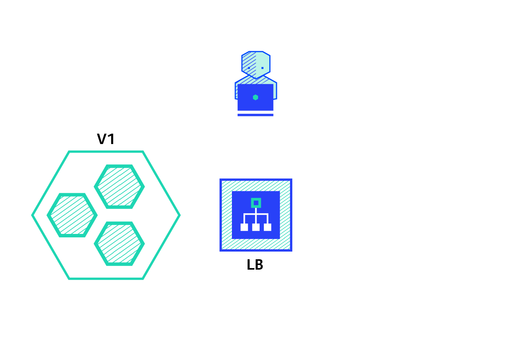

# Kubernetes

## Index
* [Detailed explanation of Kubernetes Archetecture](https://devopscube.com/kubernetes-architecture-explained/)
* [Pods](#pods)
* [Replica Controller](#replica-controller)
* [Replica Set](#replica-set)
* [Managing EKS](#managing-eks)
## Pods
<a href="files/img/pod-animation-kubernetes.gif" target="blank"></a> <br>
A pod is a group of one or more containers. A container is an enclosed, self-contained execution process, much like a process in an operating system. Kubernetes uses pods to run your code and images in the cluster.

Kubernetes works with Pods, rather than containers, so that containers in the same pod can be guaranteed to run on the same machine. Containers in the same pod share their networking infrastructure, storage resources, and lifecycle.

let us create a simple pod by cloning the below repository:
```bash
git clone https://github.com/maveric-coder/Kubernetes.git
cd Kubernetes/files/Kubernetes-Manifest-Files/
cat nginxpod.yml
```
```yaml
apiVersion: v1
kind: Pod
metadata:
  name: nginx-pod
  lables:
    app: nginx
spec:
  containers:
    -name: nginx-container
      image: nging
      ports:
      - containerPort: 80
```
Post deployment we can see the newly created Pod using command `kubectl get pods -o wide` or `kubectl get all -o wide`.
The above yml file will deploy a single pod. To deploy multiple pods at a time and manage them we can use

## Replica Controller
A Replication Controller is a structure that enables us to easily create multiple pods, then it makes sure that that number of desired pods always exists(desired state = actual state). If a pod does crash, the Replication Controller replaces it.

A Kubernetes controller such as the Replication Controller also provides other benefits, such as the ability to scale the number of pods, and to update or delete multiple pods with a single command.

We can create a Replication Controller with an imperative command, or declaratively, from a file.  For example, let us see the file `rc.yml` file:

```yml
apiVersion: v1
kind: ReplicationController
metadata: 
  name: nginx-rc
spec:
  replicas: 4
  selector:
    app: nginx
  template:
    metadata:
      name: nginx
      labels:
        app: nginx
    spec:
      containers:
        - name: nginx
          image: nginx
          ports:
            -containerPort: 80
```
This will create 4 pods and in case any pod will crash for any reason, it will immediately create a new pod and remove the defected pod.
To scale the no of pods post deployment, we can either modify the `rc.yml` file or use the below command. 
```bash
kubectl scale rc nginx-rc --replicas = 5
```
## Replica Set

ReplicaSets are declared in essentially the same way as ReplicationControllers, except that they have more options for the selector.

A sample Replica Set is below:
```yml
apiVersion: v1
kind: ReplicaSet
metadata:
  name: nginx-replicaset
spec:
  replicas: 3
  selector:
    matchLabels:
      app: nginx
    matchExpressions:
      - key: env
        operator: In
        values:
          - dev
  template:
    metadata:
      name: nginx
      labels:
        app: nginx
        env: dev
    spec:
      containers:
      - name: nginx-container
        image: nginx
        ports:
        - containerPort: 80
```
This will deploy pods similar to that of replication controller the only difference between them is that ***RS*** has `matchLabels` in place of `labels`.
```bash
kubectk describe rs nginx-replicaset
```
In this case `Selector: app=nginx,env in (dev)`, only `app = nginx` and env in dev is getting selected. If we change the operator from `In` to `NotIn` the deployemnt will fail as there is mismatch of the labels.

## Deployment
A Deployment provides declarative updates for Pods and ReplicaSets.

We describe a desired state in a Deployment, and the Deployment Controller changes the actual state to the desired state at a controlled rate. We can define Deployments to create new ReplicaSets, or to remove existing Deployments and adopt all their resources with new Deployments.
```yaml
apiVersion: apps/v1
kind: Deployment
metadata:
  name: nginx-deployment
  labels:
    app: nginx
spec:
  replicas: 3
  selector:
    matchLabels:
      app: nginx
  template:
    metadata:
      labels:
        app: nginx
    spec:
      containers:
      - name: nginx
        image: nginx:1.14.2
        ports:
        - containerPort: 80
```
```bash
kubectl describe deployment nginx-deployment
```

The `StrategyType` is `RollingUpdate`. This value can also be set to `Recreate`.
By default we have a `minReadySeconds` value of `0`; we can change that value if we want pods to be up and running for a certain amount of time -- say, to load resources -- before they're truly considered "ready".
The `RollingUpdateStrategy` shows that we have a limit of `1` `maxUnavailable` -- meaning that when we're updating the Deployment, we can have up to `1` missing pod before it's replaced, and `1 maxSurge`, meaning we can have one extra pod as we scale the new pods back up.

The created ReplicaSet ensures that there are three nginx Pods.

The pod-template-hash label is added by the Deployment controller to every ReplicaSet that a Deployment creates or adopts.

This label ensures that child ReplicaSets of a Deployment do not overlap. It is generated by hashing the PodTemplate of the ReplicaSet and using the resulting hash as the label value that is added to the ReplicaSet selector, Pod template labels, and in any existing Pods that the ReplicaSet might have.

### Updating a Deployment
**Note:** A Deployment's rollout is triggered if and only if the Deployment's Pod template (that is, .spec.template) is changed, for example if the labels or container images of the template are updated. Other updates, such as scaling the Deployment, do not trigger a rollout.

Follow the steps given below to update your Deployment:

**1. Let's update the nginx Pods to use the nginx:1.16.1 image instead of the nginx:1.14.2 image.**

```bash
kubectl set image deployment.v1.apps/nginx-deployment nginx=nginx:1.16.1
```
or use the following command:

```bash
kubectl set image deployment/nginx-deployment nginx=nginx:1.16.1
```
where deployment/nginx-deployment indicates the Deployment, nginx indicates the Container the update will take place and nginx:1.16.1 indicates the new image and its tag.

The output is similar to: `deployment.apps/nginx-deployment image updated`

**2. To see the rollout status, run:**
```bash
kubectl rollout status deployment/nginx-deployment
```
  * Run `kubectl get rs` to see that the Deployment updated the Pods by creating a new ReplicaSet and scaling it up to 3 replicas, as well as scaling down the old ReplicaSet to 0 replicas.
```bash
kubectl get rs
```
  * Running `get pods` should now show only the new Pods:
```bash
kubectl get pods
```

### Checking Rollout History of a Deployment
Follow the steps given below to check the rollout history:

**1. First, check the revisions of this Deployment:**
```bash
kubectl rollout history deployment/nginx-deployment
```

**2. To see the details of each revision, run:**
```bash
kubectl rollout history deployment/nginx-deployment --revision=2
```
### Rolling Back to a Previous Revision
Follow the steps given below to rollback the Deployment from the current version to the previous version, which is version 2.

**1. Now you've decided to undo the current rollout and rollback to the previous revision:**
```bash
kubectl rollout undo deployment/nginx-deployment
```
Alternatively, you can rollback to a specific revision by specifying it with --to-revision:
```bash
kubectl rollout undo deployment/nginx-deployment --to-revision=2
```

**2. Check if the rollback was successful and the Deployment is running as expected, run:**
```bash
kubectl get deployment nginx-deployment
```
**3. Get the description of the Deployment:**
```bash
kubectl describe deployment nginx-deployment
```
## Deployments in Kubernetes

### Recreate

<a href="files/img/recreate.gif" target="blank"></a> <br>
The recreate strategy is a dummy deployment which consists of shutting down version V1 then deploying version V2 after version V1 is turned off. This technique implies downtime of the service that depends on both shutdown and boot duration of the application.

Pros:

* Easy to setup.
* Application state entirely renewed.

Cons:

* High impact on the user, expect downtime that depends on both shutdown and boot duration of the application.

### Ramped

<a href="files/img/ramped.gif" target="blank"></a> <br>
The ramped deployment strategy consists of slowly rolling out a version of an application by replacing instances one after the other until all the instances are rolled out. It usually follows the following process: with a pool of version V1 behind a load balancer, one instance of version V2 is deployed. When the service is ready to accept traffic, the instance is added to the pool. Then, one instance of version V1 is removed from the pool and shut down.

Depending on the system taking care of the ramped deployment, you can tweak the following parameters to increase the deployment time:

* Parallelism, max batch size: Number of concurrent instances to roll out.
* Max surge: How many instances to add in addition of the current amount.
* Max unavailable: Number of unavailable instances during the rolling update procedure.

Pros:

* Easy to set up.
* Version is slowly released across instances.
* Convenient for stateful applications that can handle rebalancing of the data.

Cons:

* Rollout/rollback can take time.
* Supporting multiple APIs is hard.
* No control over traffic.

### Blue/Green

<a href="files/img/blue-green.gif" target="blank"></a> <br>
The blue/green deployment strategy differs from a ramped deployment, version V2 (green) is deployed alongside version V1 (blue) with exactly the same amount of instances. After testing that the new version meets all the requirements the traffic is switched from version V1 to version V2 at the load balancer level.
Pros:

* Instant rollout/rollback.
* Avoid versioning issue, the entire application state is changed in one go.

Cons:

* Expensive as it requires double the resources.
* Proper test of the entire platform should be done before releasing to production.
* Handling stateful applications can be hard.

### Canary

<a href="files/img/canary.gif" target="blank"></a> <br>
A canary deployment consists of gradually shifting production traffic from version V1 to version V2. Usually the traffic is split based on weight. For example, 90 percent of the requests go to version V1, 10 percent go to version V2.

This technique is mostly used when the tests are lacking or not reliable or if there is little confidence about the stability of the new release on the platform.

Pros:

* Version released for a subset of users.
* Convenient for error rate and performance monitoring.
* Fast rollback.

Cons:

* Slow rollout.

### A/B testing

<a href="files/img/a-b.gif" target="blank"></a> <br>
A/B testing deployments consists of routing a subset of users to a new functionality under specific conditions. It is usually a technique for making business decisions based on statistics, rather than a deployment strategy. However, it is related and can be implemented by adding extra functionality to a canary deployment so we will briefly discuss it here.

This technique is widely used to test conversion of a given feature and only roll-out the version that converts the most.

Here is a list of conditions that can be used to distribute traffic amongst the versions:

* By browser cookie
* Query parameters
* Geolocalisation
* Technology support: browser version, screen size, operating system, etc.

Pros:

* Several versions run in parallel.
* Full control over the traffic distribution.

Cons:

* Requires intelligent load balancer.
* Hard to troubleshoot errors for a given session, distributed tracing becomes mandatory.

### Shadow

<a href="files/img/shadow.gif" target="blank"></a> <br>
A shadow deployment consists of releasing version V2 alongside version V1, fork version V1’s incoming requests and send them to version V2 as well without impacting production traffic. This is particularly useful to test production load on a new feature. A rollout of the application is triggered when stability and performance meet the requirements.

This technique is fairly complex to setup and needs special requirements, especially with egress traffic. For example, given a shopping cart platform, if you want to shadow test the payment service you can end-up having customers paying twice for their order. In this case, you can solve it by creating a mocking service that replicates the response from the provider.

Pros:

* Performance testing of the application with production traffic.
* No impact on the user.
* No rollout until the stability and performance of the application meet the requirements.

Cons:

* Expensive as it requires double the resources.
* Not a true user test and can be misleading.
* Complex to setup.
* Requires mocking service for certain cases.


## apply vs create

The key difference between kubectl apply and create is that apply creates Kubernetes objects through a declarative syntax, while the create command is imperative.

The command set kubectl apply is used at a terminal's command-line window to create or modify Kubernetes resources defined in a manifest file. This is called a declarative usage. The state of the resource is declared in the manifest file, then kubectl apply is used to implement that state.

In contrast, the command set kubectl create is the command you use to create a Kubernetes resource directly at the command line. This is an imperative usage. You can also use kubectl create against a manifest file to create a new instance of the resource. However, if the resource already exists, you will get an error.

### Example of kubectl apply
Let's explore the details of both kubectl usages. First, let's look at kubectl apply. Listing 1 below is a manifest file that describes a Kubernetes deployment that has three replicas of a nginx container image.

```yml
apiVersion: apps/v1
kind: Deployment
metadata:
  name: mydeployment
  labels:
    app: nginx
spec:
  replicas: 3
  selector:
    matchLabels:
      app: nginx
  template:
    metadata:
      labels:
        app: nginx
    spec:
      containers:
      - name: nginx
        image: nginx:latest
        ports:
        - containerPort: 80
```

The name of the deployment manifest file in Listing 1 is mydeployment.yaml. If you run the command below, it will create a deployment according to the contents of this manifest file.
```bash
kubectl apply -f mydeployment.yaml
```
Executing the command will create the following response:

`deployment/mydeployment created`

When you run the command `kubectl get deployment`, you'll get the following output:

NAME           READY   UP-TO-DATE   AVAILABLE   AGE
mydeployment   3/3     3            3           7m10s
Here, we've created the deployment named mydeployment, and it is running its three pods.

Example of kubectl create
Now, let's use kubectl create to try to create a deployment imperatively, like so:
```bash
kubectl create deployment mydeployment --image=nginx
```
When you execute the imperative command, you'll get the following result:

`Error from server (AlreadyExists): deployments.apps "mydeployment" already exists`

This makes sense. Remember, if you try to use kubectl create against a resource that already exists, you'll get an error.

However, let's try to execute kubectl create for a resource that doesn't exist. In this case, we'll create a Kubernetes deployment named yourdeployment. We'll create it using the following command:
```bash
kubectl create deployment yourdeployment --image=nginx
```
You'll get the following output, indicating success:

`deployment.apps/yourdeployment created`

## Managing EKS
```bash
curl --silent --location "https://github.com/weaveworks/eksctl/releases/latest/download/eksctl_$(uname -s)_amd64.tar.gz" | tar xz -C /tmp
sudo mv /tmp/eksctl /usr/bin
```
Check the version of installed eksctl
```bash
eksctl version
eksctl --help
```
Now, we will create an EKS clusture and will fill the needed details in the command line.
```bash
eksctl create cluster --name myCluster --version 1.27 --region us-east-1 --nodegroup-name standard-workers --node-type t2.micro --nodes 3 --nodes-min 1 --nodes-max 4 --managed
```
Post execution of the above step, we need to wait for 15-20 mins for the cluster to created nodes. Meanwhile we can go to EKS and see the resources getting created with time.

```bash
kubectl get svc --all-namespaces
```
The above command will list all the services and namespaces. Delete all the services having `EXTERNAL_IP` before proceedign to delete the clusture.
```bash
kubectl delete svc service-name
```
Post deletion of seleted services, proceed to delete the whole clusture.
```bash
eksctl delete cluster --name myCluster
```
```bash
sudo apt-get update
# apt-transport-https may be a dummy package; if so, you can skip that package
sudo apt-get install -y apt-transport-https ca-certificates curl
curl -fsSL https://pkgs.k8s.io/core:/stable:/v1.28/deb/Release.key | sudo gpg --dearmor -o /etc/apt/keyrings/kubernetes-apt-keyring.gpg
echo 'deb [signed-by=/etc/apt/keyrings/kubernetes-apt-keyring.gpg] https://pkgs.k8s.io/core:/stable:/v1.28/deb/ /' | sudo tee /etc/apt/sources.list.d/kubernetes.list

sudo apt-get update
sudo apt-get install -y docker.io
sudo systemctl enable docker

sudo apt-get update
sudo apt-get install -y kubelet kubeadm kubectl
sudo apt-mark hold kubelet kubeadm kubectl
```
```bash
sudo kubeadm init --pod-network-cidr=10.244.0.0/16
mkdir -p $HOME/.kube
sudo cp -i /etc/kubernetes/admin.conf $HOME/.kube/config
sudo chown $(id -u):$(id -g) $HOME/.kube/config
```
```bash

kubectl apply -f https://github.com/flannel-io/flannel/releases/latest/download/kube-flannel.yml

kubectl apply -f https://github.com/weaveworks/weave/releases/download/v2.8.1/weave-daemonset-k8s.yaml

kubectl apply -f https://raw.githubusercontent.com/cloudnativelabs/kube-router/master/daemonset/kubeadm-kuberouter.yaml


sudo -i
swapoff -a
exit
strace -eopenat kubectl version
```


Objects in Kubernetes:
* POD 
* Service
* ReplicaController
* ReplicaSet
* DS
* VolumeJobs

```bash
Kubectl get nodes
kubectl get ns


kubectl get componentstatuses

sudo ufw status verbose
sudo ufw disable
## turn on
sudo ufw enable
## make sure your kube-apiserver can get through port 6443
sudo ufw allow 6443/tcp


Services:
ClustureIP
NodePort
LoadBalancer


```
